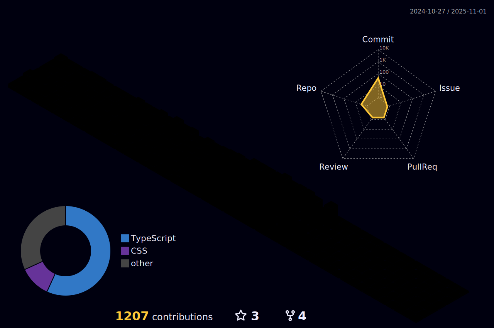

<!-- Header -->

### Welcome to my GitHub Profile 👋

Hi guys, I'm **Matheus Letra**. I'm a developer from Osvaldo Cruz, São Paulo, Brazil. I am currently working as a **Delphi Developer** and participating in projects involving **React Native**, **NodeJs**, **React.Js**, and **Java (Android)** at **[Arth Tecnologia](https://github.com/ArthTecnologia)**.

---

### 🛠️ Technologies & Tools

  

---

### 📈 GitHub Stats

  

  
  

  
  

  

---

### 🌱 Currently Learning

- **TypeScript**
- **Domain-Driven Design (DDD)**
- **SOLID Principles**

---

### 📫 How to Reach Me

  
  
  
  

<!-- Footer -->

